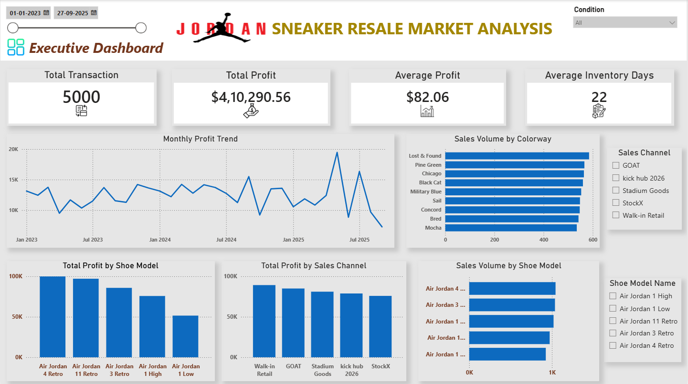
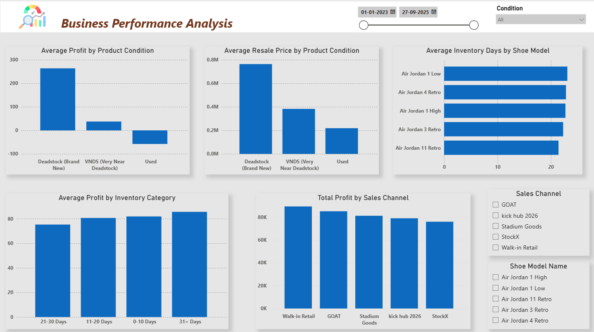

# Jordan Sneaker Market Analysis | SQL Server & Power BI

## Project Summary

This project demonstrates end-to-end data analysis using SQL Server and Power BI. It covers data validation, exploratory data analysis (EDA), business analysis, and interactive dashboard development to generate actionable business insights for sneaker resale market performance.

---

## Project Overview

Data-driven decision-making plays a critical role in improving product strategy, inventory planning, pricing decisions, and overall business performance. This project analyzes a Jordan sneaker market dataset to uncover actionable insights that help business stakeholders evaluate product performance, profitability, sales channel effectiveness, inventory efficiency, and customer demand.

Using **SQL Server** for data analysis and **Power BI** for interactive visualization, the project follows a complete business analytics workflow—from data cleaning and exploratory data analysis (EDA) to business-focused SQL analysis and dashboard development. The result is a set of practical insights and recommendations that support better business decision-making.

---

## Business Problem

Businesses operating in the sneaker resale market must balance customer demand, profitability, inventory turnover, and sales channel performance when making product selection and inventory investment decisions.

Without data-driven analysis, it becomes difficult to identify which products deserve additional investment, which sales channels generate the greatest value, or how operational factors such as inventory turnover and product condition influence profitability.

This project addresses these challenges by analyzing historical transaction data to answer key business questions and provide actionable recommendations for improving business performance.

The analysis focuses on answering questions such as:

- Which shoe models generate the highest sales and profit?
- Which colorways have the strongest customer demand?
- Which sales channels perform best?
- How does product condition affect resale price and profitability?
- Which shoe models sell the fastest based on inventory turnover?
- Which shoe model–colorway combinations should the business prioritize based on overall performance?

---

## Project Objectives

The objectives of this project are to:

- Evaluate overall product performance.
- Identify the most profitable shoe models and colorways.
- Compare the performance of different sales channels.
- Analyze inventory turnover efficiency.
- Measure the impact of product condition on resale value and profitability.
- Identify customer demand trends across products and colorways.
- Deliver business recommendations supported by data analysis.

---

## Dataset Overview

The dataset contains **5,000 Air Jordan sneaker market transactions**, providing detailed information about product characteristics, pricing, inventory, and sales performance.

### Dataset Features

| Column | Description |
|---------|-------------|
| Transaction_ID | Unique identifier for each transaction |
| Sale_Date | Date of sale |
| Shoe_Model | Jordan sneaker model |
| Colorway | Product colorway |
| Condition | Product condition |
| Retail_Price_USD | Original retail price |
| Resale_Price_USD | Selling price |
| Sales_Channel | Sales platform where the product was sold |
| Days_in_Inventory | Number of days before the product was sold |
| Profit_Margin_USD | Profit earned from each transaction |

---

## Dataset Source

This project uses the **Air Jordan Sneaker Market and Resale Data (2023–2026)** dataset from Kaggle, containing 5,000 sneaker resale transactions with information on pricing, profitability, inventory, and sales channels.

**Source:** Kaggle – https://www.kaggle.com/datasets/abdullahmeo/air-jordan-sneaker-market-and-resale-data2023-2026

*Note:* The dataset was used for educational and portfolio purposes. All SQL analysis, business insights, and Power BI dashboards were independently developed.

---

## Tools & Technologies

| Category | Technology |
|----------|------------|
| Database | SQL Server |
| Query Language | SQL |
| Data Visualization | Power BI |
| Version Control | Git & GitHub |

---

## Project Workflow

The project follows a structured business analytics workflow, progressing from understanding the business problem to delivering actionable insights through SQL analysis and interactive Power BI dashboards.

```text
Business Problem
        │
        ▼
Data Validation & Preparation
        │
        ▼
Exploratory Data Analysis (EDA)
        │
        ▼
Business Analysis
        │
        ▼
Business Insights & Recommendations
        │
        ▼
Executive Summary
        │
        ▼
Interactive Power BI Dashboard
```

This workflow ensures that every recommendation presented in the dashboard is supported by structured data analysis and aligned with real business questions.

---

## Data Validation & Preparation

Before beginning the analysis, the dataset was validated to ensure its quality and suitability for business analysis.

The validation process included:

- Reviewing the dataset structure and verifying column data types.
- Checking for missing (NULL) values.
- Checking for duplicate transactions.
- Confirming the dataset was complete and consistent.
- Creating a dedicated analysis table (`jordan_market_clean`) to separate the validated dataset from the original source data.

The validation confirmed that the dataset required minimal cleaning and was suitable for analysis. All SQL queries and Power BI visualizations were built using the validated analysis table.

---

## Exploratory Data Analysis (EDA)

Before addressing the business questions, an exploratory data analysis (EDA) was conducted to understand the overall characteristics of the dataset.

The exploration focused on:

- Total number of transactions
- Sales date range
- Number of unique shoe models
- Number of unique colorways
- Distribution of sales channels
- Distribution of product conditions

This initial analysis provided a clear understanding of the dataset and helped identify the key dimensions for the subsequent business analysis.

---

# Business Analysis

The primary objective of this project is to answer business-oriented questions and transform transaction data into meaningful business insights that support data-driven decision-making.

To achieve this, the analysis is organized into seven key business domains. Each section addresses a specific business objective, investigates relevant business questions, and concludes with business insights and recommendations based on the analytical findings.

---

## 1. Product Performance Analysis

**Objective**

Evaluate the performance of Jordan sneaker models and colorways to identify products that consistently generate strong customer demand.

**Business Questions**

- Which shoe models have the highest sales volume?
- Which shoe model–colorway combinations have the highest sales volume?
- Which colorways are the most popular across all shoe models?

---

## 2. Profitability Analysis

**Objective**

Identify the products that generate the greatest financial return and evaluate overall profitability.

**Business Questions**

- Which shoe models generate the highest total profit?
- Which shoe models generate the highest average profit per transaction?
- Which shoe models record the highest number of loss-making transactions?

---

## 3. Sales Channel Analysis

**Objective**

Evaluate the performance of different sales channels to understand their contribution to profitability, sales performance, and inventory efficiency.

**Business Questions**

- Which sales channel generates the highest total profit?
- Which sales channel generates the highest average profit?
- Which sales channel records the highest sales volume?
- Which sales channel achieves the fastest inventory turnover?

---


## 4. Inventory Analysis

**Objective**

Evaluate inventory turnover efficiency and identify opportunities to improve inventory management.

**Business Questions**

- Which shoe models sell the fastest based on average inventory days?
- Is there a relationship between inventory turnover and profitability?

---

## 5. Product Condition Analysis

**Objective**

Measure the impact of product condition on resale value and profitability.

**Business Questions**

- How does product condition affect resale price?
- How does product condition affect profitability?

---

## 6. Demand Analysis

**Objective**

Understand customer demand by identifying popular colorways and evaluating demand patterns across different shoe models.

**Business Questions**

- Which colorways have the highest demand?
- Do popular colorways remain popular across different shoe models?

---

## 7. Overall Product Performance

**Objective**

Identify products that provide the strongest balance between customer demand, profitability, and inventory efficiency.

**Business Question**

- Which shoe model–colorway combinations provide the best balance of sales volume, profitability, and inventory turnover?

---

Each business question was answered using SQL Server through structured queries, followed by business insights and recommendations. The final findings were visualized in interactive Power BI dashboards to support data-driven business decision-making.

---

# Power BI Dashboard

The SQL analysis was transformed into interactive Power BI dashboards to enable business stakeholders to monitor performance, compare products, and support data-driven decision-making.

The dashboard is organized into two pages:

## Executive Dashboard

The Executive Dashboard provides a high-level overview of business performance through KPIs and summary visualizations.

The dashboard provides a high-level overview through the following KPIs:

- Total Revenue
- Total Profit
- Average Profit
- Total Transactions

The dashboard also highlights:

- Sales trends over time
- Sales by shoe model
- Profit by sales channel
- Product condition distribution

📷 Executive Dashboard



---

## Business Performance Dashboard

The Business Performance Dashboard provides detailed operational insights.

It enables users to analyze:

- Product profitability
- Inventory turnover
- Colorway demand
- Sales channel performance
- Product condition
- Product comparison using interactive filters

📷 Business Performance Dashboard



---

## Key Insights

- Air Jordan 4 Retro generated the highest total profit.
- Air Jordan 11 Retro achieved the highest average profit per transaction.
- Walk-in Retail generated the highest total and average profit among all sales channels.
- GOAT recorded the highest sales volume.
- Deadstock sneakers achieved the highest resale prices and profitability.
- Inventory turnover remained relatively consistent across shoe models.
- No single product outperformed across every KPI, indicating that product prioritization should align with the business objective, whether the focus is profitability, customer demand, or inventory turnover.

---

## Business Recommendations

Based on the analysis, the following recommendations are proposed:

- Prioritize high-performing shoe model–colorway combinations that consistently balance demand, profitability, and inventory efficiency.
- Increase inventory allocation for products with strong demand and healthy profit margins.
- Continue leveraging high-performing sales channels while investigating opportunities to improve lower-performing channels.
- Maintain product quality standards, as better product condition significantly improves resale value and profitability.
- Consider profitability alongside inventory turnover when making stocking decisions rather than relying on sales speed alone.

---

## Skills Demonstrated

- SQL Data Cleaning
- Data Validation
- Exploratory Data Analysis (EDA)
- Aggregate Functions
- GROUP BY
- CASE Expressions
- Business Analytics
- KPI Development
- Power BI Dashboard Design
- Business Insight Generation

---

## Repository Structure

```text
Jordan-Sneaker-Market-Analysis/
│
├── Dataset/
│   └── jordan_market_dataset_2026.csv
│
├── SQL/
│   └── jordan_sneaker_market_analysis.sql
│
├── Power BI/
│   └── jordan_sneaker_market_analysis.pbix
│
├── Dashboard/
│   ├── Executive_Dashboard.png
│   └── Business_Performance_Dashboard.png
│
└── README.md
```
---

# How to Run the Project

1. Import the dataset into SQL Server.
2. Execute the SQL script (`jordan_sneaker_market_analysis.sql`).
3. Open the Power BI dashboard (`jordan_sneaker_market_analysis.pbix`).
4. Refresh the Power BI data connection if prompted.
5. Explore the interactive dashboards using the available filters and slicers.

---

# Author

**Pranav P A**

- GitHub: https://github.com/Pranav175-bit
- LinkedIn: https://www.linkedin.com/in/pranav-p-a-8b3a57350/
 
---

## License

This project is licensed under the MIT License.
