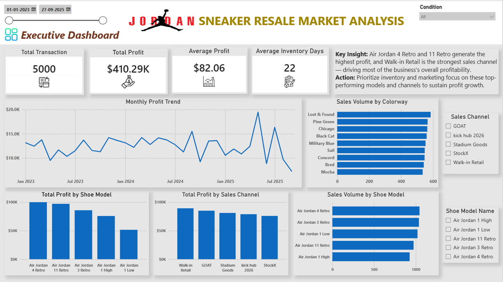
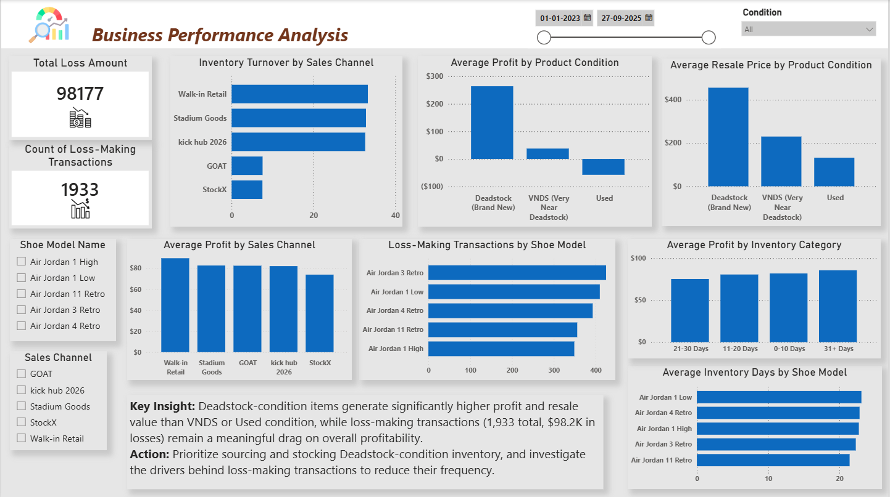
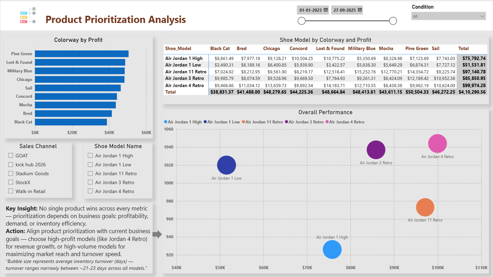

# Jordan Sneaker Market Analysis | SQL Server & Power BI

## Project Summary

This project demonstrates end-to-end data analysis using SQL Server and Power BI. It covers data validation, exploratory data analysis (EDA), business analysis, and interactive dashboard development to generate actionable business insights for sneaker resale market performance.

---

## Business Problem

Businesses operating in the sneaker resale market must balance customer demand, profitability, inventory turnover, and sales channel performance when making product selection and inventory investment decisions.

Without data-driven analysis, it becomes difficult to identify which products deserve additional investment, which sales channels generate the greatest value, or how operational factors such as inventory turnover and product condition influence profitability.

This project addresses these challenges by analyzing historical transaction data to answer key business questions and provide actionable recommendations for improving business performance.

The analysis focuses on answering questions such as:

- Which shoe models generate the highest sales and profit?
- Which colorways have the strongest customer demand?
- Which sales channels perform best?
- How does product condition affect resale price and profitability?
- Which shoe models sell the fastest based on inventory turnover?
- Which shoe model–colorway combinations should the business prioritize based on overall performance?
- Which shoe models are most associated with loss-making transactions?
- Which sales channels turn over inventory the fastest?

---

## Dataset Overview

The dataset contains **5,000 Air Jordan sneaker market transactions**, providing detailed information about product characteristics, pricing, inventory, and sales performance.

### Dataset Features

| Column | Description |
|---------|-------------|
| Transaction_ID | Unique identifier for each transaction |
| Sale_Date | Date of sale |
| Shoe_Model | Jordan sneaker model |
| Colorway | Product colorway |
| Condition | Product condition |
| Retail_Price_USD | Original retail price |
| Resale_Price_USD | Selling price |
| Sales_Channel | Sales platform where the product was sold |
| Days_in_Inventory | Number of days before the product was sold |
| Profit_Margin_USD | Profit earned from each transaction |

---

## Dataset Source

This project uses the **Air Jordan Sneaker Market and Resale Data (2023–2026)** dataset from Kaggle, containing 5,000 sneaker resale transactions with information on pricing, profitability, inventory, and sales channels.

**Source:** Kaggle – https://www.kaggle.com/datasets/abdullahmeo/air-jordan-sneaker-market-and-resale-data2023-2026

*Note:* While the dataset is titled "2023–2026" on Kaggle, the actual transaction records analyzed in this project span January 2023 to September 2025.

*Note:* The dataset was used for educational and portfolio purposes. All SQL analysis, business insights, and Power BI dashboards were independently developed.

---

## Tools & Technologies

| Category | Technology |
|----------|------------|
| Database | SQL Server |
| Query Language | SQL |
| Data Visualization | Power BI |
| Version Control | Git & GitHub |

---

## Project Workflow

The project follows a structured business analytics workflow, progressing from understanding the business problem to delivering actionable insights through SQL analysis and interactive Power BI dashboards.

```text
Business Problem
        │
        ▼
Data Validation & Preparation
        │
        ▼
Exploratory Data Analysis (EDA)
        │
        ▼
Business Analysis
        │
        ▼
Business Insights & Recommendations
        │
        ▼
Interactive Power BI Dashboard
```
---

## Business Analysis

The SQL analysis was organized into seven business-focused domains to answer real business questions and support data-driven decision-making.

The analysis covers:

1. **Product Performance** – Evaluates sales performance across shoe models and colorways.
2. **Profitability** – Identifies products that generate the highest financial returns and analyzes loss-making transactions.
3. **Sales Channel Performance** – Compares profitability, sales volume, and inventory efficiency across different sales channels.
4. **Inventory Analysis** – Evaluates inventory turnover and its relationship with profitability.
5. **Product Condition Analysis** – Measures the impact of product condition on resale price and profit.
6. **Demand Analysis** – Identifies the most popular colorways and demand patterns across shoe models.
7. **Overall Product Performance** – Evaluates products by balancing sales volume, profitability, and inventory efficiency.

Each business domain was analyzed using SQL Server, followed by business insights and recommendations. The final findings were visualized through interactive Power BI dashboards.

---

## Power BI Dashboard

The SQL analysis was transformed into an interactive, 3-page Power BI dashboard to enable business stakeholders to monitor performance, compare products, and support data-driven decision-making. Each page includes a Key Insight and Action callout, translating the underlying data into clear business takeaways.

The dashboard tells a complete story across 3 pages: a high-level performance overview, a deeper operational and risk analysis, and a final view on which products to prioritize going forward.

### 1. Executive Dashboard

A high-level overview of overall business performance through key KPIs and summary visualizations.

Includes:
- Total Transactions, Total Profit, Average Profit, Average Inventory Days
- Monthly Profit Trend
- Sales Volume by Colorway
- Total Profit by Shoe Model
- Total Profit by Sales Channel
- Sales Volume by Shoe Model

**Key Insight:** Air Jordan 4 Retro and 11 Retro generate the highest profit, and Walk-in Retail is the strongest sales channel — driving most of the business's overall profitability.
**Action:** Prioritize inventory and marketing focus on these top-performing models and channels to sustain profit growth.



---

### 2. Business Performance Analysis

Detailed operational insights into profitability, inventory turnover, and loss-making transactions.

Includes:
- Total Loss Amount, Count of Loss-Making Transactions
- Average Profit and Resale Price by Product Condition
- Average Profit by Inventory Category
- Average Profit by Sales Channel
- Average Inventory Days by Shoe Model
- Inventory Turnover by Sales Channel
- Loss-Making Transactions by Shoe Model

**Key Insight:** Deadstock-condition items generate significantly higher profit and resale value than VNDS or Used condition, while loss-making transactions (1,933 total, $98.2K in losses) remain a meaningful drag on overall profitability.
**Action:** Prioritize sourcing and stocking Deadstock-condition inventory, and investigate the drivers behind loss-making transactions to reduce their frequency.



---
### 3. Product Prioritization Analysis

Combines profitability, demand, and inventory efficiency into a single view to guide product prioritization decisions.

Includes:
- Profit by Colorway
- Shoe Model × Colorway Profit Matrix
- Overall Performance comparison (Profit vs. Sales Volume vs. Inventory Turnover) by Shoe Model

**Key Insight:** No single product wins across every metric — prioritization depends on business goals: profitability, demand, or inventory efficiency.
**Action:** Align product prioritization with current business goals — choose high-profit models (like Jordan 4 Retro) for revenue growth, or high-volume models for maximizing market reach and turnover speed.



---
## Key Insights

- Air Jordan 4 Retro generated the highest total profit; Air Jordan 11 Retro achieved the highest average profit per transaction.
- Walk-in Retail generated the highest total and average profit among all sales channels, though it also has the slowest inventory turnover.
- GOAT and StockX turn over inventory the fastest (~7 days average), compared to Walk-in Retail (~33 days) — a significant efficiency gap across channels.
- Deadstock sneakers achieved the highest resale prices and profitability among all product conditions.
- Loss-making transactions totaled 1,933 (out of 5,000), amounting to $98.2K in losses — concentrated most heavily in Air Jordan 3 Retro and Air Jordan 1 Low.
- No single shoe model outperforms across every metric simultaneously — profitability, demand, and inventory turnover each favor different models, meaning prioritization should align with specific business goals rather than a single "best" product.

---

## Business Recommendations

Based on the analysis, the following recommendations are proposed:

- Prioritize high-performing shoe model–colorway combinations that consistently balance demand, profitability, and inventory efficiency.
- Increase inventory allocation for products with strong demand and healthy profit margins.
- Continue leveraging high-performing sales channels while investigating opportunities to improve lower-performing channels.
- Maintain product quality standards, as better product condition significantly improves resale value and profitability.
- Consider profitability alongside inventory turnover when making stocking decisions rather than relying on sales speed alone.

---

## Skills Demonstrated

- SQL
- Data Cleaning
- Data Validation
- Exploratory Data Analysis (EDA)
- Aggregate Functions
- CASE Expressions
- GROUP BY
- KPI Development
- Business Analytics
- Business Insight Generation
- Power BI Dashboard Design
- DAX (Measures, CALCULATE, DISTINCTCOUNT)
- Matrix & Scatter Chart Visualization
- Data Storytelling & Insight Communication

---

## Repository Structure

```text
Jordan-Sneaker-Market-Analysis/
│
├── Dataset/
│   └── jordan_market_dataset_2026.csv
│
├── SQL/
│   └── jordan_sneaker_market_analysis.sql
│
├── Power BI/
│   └── jordan_sneaker_market_analysis.pbix
│
├── Dashboard/
│   ├── Executive_Dashboard.png
│   ├── Business_Performance_Dashboard.png
│   └── Product_Prioritization_Analysis.png
│
└── README.md
```
---

## How to Run the Project

1. Import the dataset into SQL Server.
2. Execute the SQL script (`jordan_sneaker_market_analysis.sql`).
3. Open the Power BI dashboard (`jordan_sneaker_market_analysis.pbix`).
4. Refresh the Power BI data connection if prompted.
5. Explore the interactive dashboards using the available filters and slicers.

---

## Author

**Pranav P A**

- GitHub: https://github.com/Pranav175-bit
- LinkedIn: https://www.linkedin.com/in/pranav-p-a-8b3a57350/
 
---

## License

This project is licensed under the MIT License.
